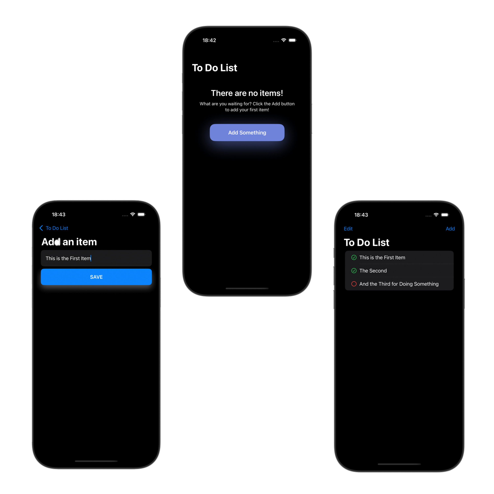

# 📝 Simple To-Do List App

This is a simple and minimalistic **To-Do List** application built with **SwiftUI**.  
It was developed as a learning project to practice SwiftUI fundamentals and basic data persistence using `UserDefaults`.

## 🚀 Features

- ✅ Add and delete tasks
- 📌 Mark tasks as completed
- 🌙 Light/Dark Mode support
- 💾 Data persistence using UserDefaults

## 🖼️ Screenshots

## 🛠 Technologies Used

- **SwiftUI**
- **UserDefaults** for local data storage
- Lightweight **MVVM** structure
